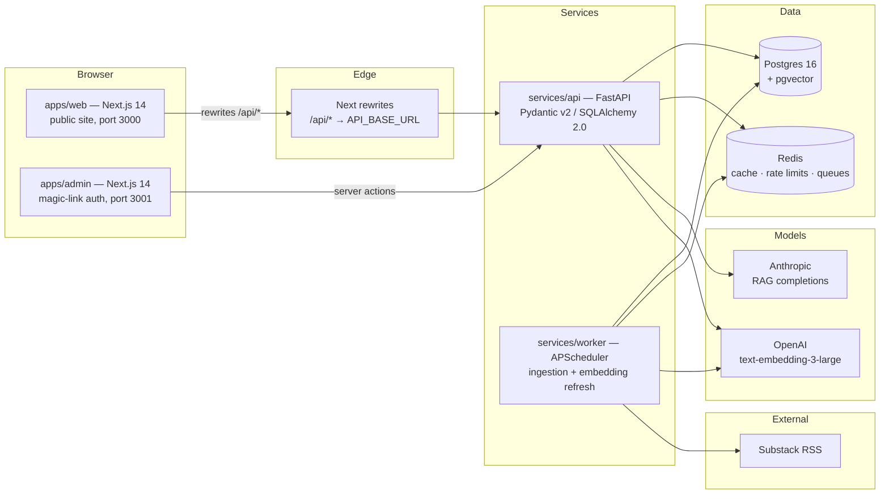
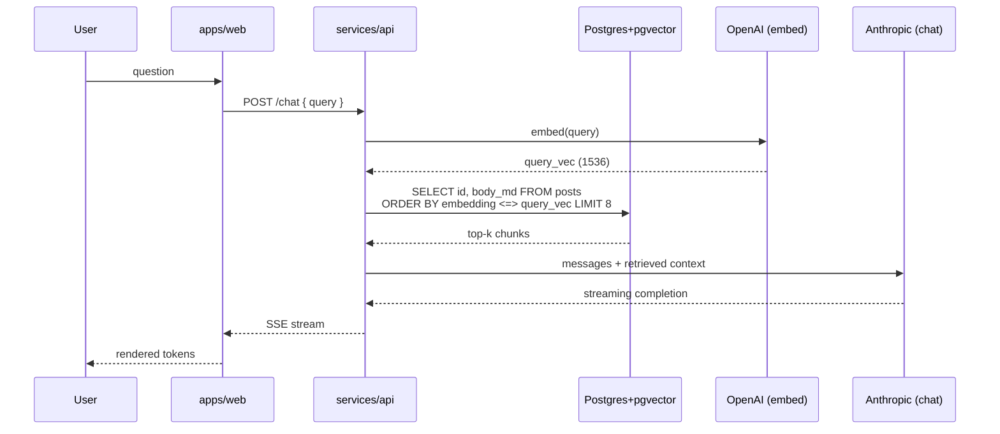

# Architecture

The Engine Room is a portfolio site that demonstrates production AI infrastructure. The system is intentionally over-built for a personal site so that every piece doubles as a working portfolio artifact.

## High-level diagram



## Data flow — write path

1. Admin posts content via the admin app (`apps/admin`).
2. Admin posts to FastAPI (`services/api`); writes hit Postgres in a single transaction.
3. The new row is left with `embedding = NULL` and `embedding_indexed_at = NULL`.
4. The next `refresh_embeddings` tick (every 5m) finds it, calls OpenAI for a 1536-dim embedding, writes back, sets `embedding_indexed_at = NOW()`.

## Data flow — Substack ingestion

1. Worker `ingest_substack` ticks every 30m.
2. Reads `SUBSTACK_FEED_URL` (RSS), dedupes against `posts.canonical_url`.
3. New entries: HTML→markdown, insert with `source='substack'`, `published_at=entry.published`.
4. `refresh_embeddings` picks them up on its next tick (same path as above).

## RAG pipeline (Phase 2)



- Cosine distance via `<=>` on the HNSW index (`m=16`, `ef_construction=64`).
- Two corpora are merged in retrieval: `projects` and `posts`. Each retrieved chunk includes its source so the UI can cite.
- All RAG calls go through one tracer span — full request → embed → retrieve → LLM is one trace in the OTel exporter.

## Caching strategy

| Layer | Store | Key | TTL |
|---|---|---|---|
| Page-level (web) | Next.js fetch cache | route + params | 60s for lists, on-demand revalidate for detail |
| RAG result | Redis DB 0 | sha256(query) | 5m |
| Embedding (idempotency) | (none — DB is the cache) | — | — |
| Rate limits | Redis DB 1 | ip + route | sliding 1m |

## Auth

- **Public site** — no auth. SSR-critical content works without JS.
- **Admin** — NextAuth v5, email magic-link, single-admin allowlist via `ADMIN_EMAILS`. Sessions are JWT-only; the admin user record is mirrored in the API's `admin_users` table.

## Observability

OpenTelemetry across both Python services and (Phase 2) the Next apps. In dev the OTLP endpoint is unset → traces print to stderr via the console exporter. In prod, set `OTEL_EXPORTER_OTLP_ENDPOINT` to ship to Honeycomb / Tempo / etc.

## Repo layout

```
apps/
  web/             Public Next.js (port 3000)
  admin/           Admin Next.js (port 3001, NextAuth)
services/
  api/             FastAPI — owns all data
  worker/          APScheduler — ingestion + embedding
packages/
  ui/              Design system: tokens, motion, primitives, Tailwind preset
  types/           TS types generated from FastAPI OpenAPI
infra/             docker-compose, per-service Dockerfiles, .env.example
docs/              ARCHITECTURE, AGENTS, DESIGN
```

## Non-negotiables (carried from the brief)

1. Apple-level minimalism — strict monochrome + one accent.
2. Framer Motion springs everywhere; eased curves only for non-organic UI.
3. Reduced motion respected globally.
4. Single display face + single mono.
5. Every public page must SSR without JavaScript for critical content.
